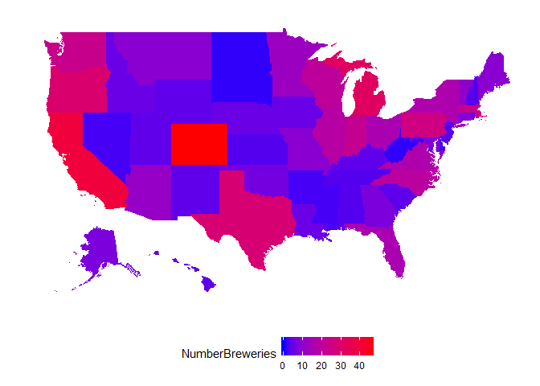
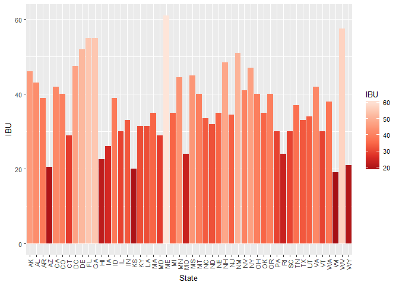
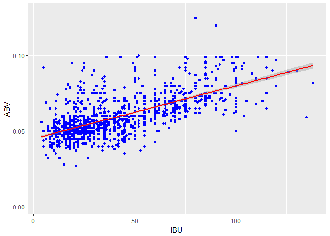

# Analysis of Beers acros the USA
David Churchman  
June 26, 2017  

#Introduction

In recent decades, the craft beer market in the united states has exploded into an incredibly diverse landscape, with hundreds of different breweries all across the country brewing thousands of types of craft beers. As breweries have proliferated, states have developed regional tastes and breweries have reacted by specializing.  Below is an analysis of 2410 US craft beers brewed in 558 breweries across all 50 states and the District of Columbia.

Gathered below is the "Beers"" data set containing 2410 US craft beers brewed in 558 breweries. Below is listed the first six beers in the data set, showing information about the ABV, IBU, style, and serving size, along with a Brewery ID which will be used to link this data to the brewery data.

```r
#Required packages:
library(ggplot2)
library(fiftystater)
#Read in the data
beers <- read.csv('beers.csv')
head(beers)
```

```
##                  Name Beer_ID   ABV IBU Brewery_id
## 1            Pub Beer    1436 0.050  NA        409
## 2         Devil's Cup    2265 0.066  NA        178
## 3 Rise of the Phoenix    2264 0.071  NA        178
## 4            Sinister    2263 0.090  NA        178
## 5       Sex and Candy    2262 0.075  NA        178
## 6        Black Exodus    2261 0.077  NA        178
##                            Style Ounces
## 1            American Pale Lager     12
## 2        American Pale Ale (APA)     12
## 3                   American IPA     12
## 4 American Double / Imperial IPA     12
## 5                   American IPA     12
## 6                  Oatmeal Stout     12
```

Additionally, below is the first six breweries in the "Breweries" data set, with information about the 558 breweries found in the Beers data set, listing the breweries by city and state, and with the common Brew_ID variable from the Beers data set.

```r
breweries <-read.csv('breweries.csv')
head(breweries)
```

```
##   Brew_ID                      Name          City State
## 1       1        NorthGate Brewing    Minneapolis    MN
## 2       2 Against the Grain Brewery    Louisville    KY
## 3       3  Jack's Abby Craft Lagers    Framingham    MA
## 4       4 Mike Hess Brewing Company     San Diego    CA
## 5       5   Fort Point Beer Company San Francisco    CA
## 6       6     COAST Brewing Company    Charleston    SC
```
You can see in the following table the number of craft breweries in each state, with low-population states like the Dakotas and West Virginia only containing one brewery all the way up to Colorado with 47 breweries.

```r
# A table displaying the number of breweries in each state.
table(breweries$State)
```

```
## 
##  AK  AL  AR  AZ  CA  CO  CT  DC  DE  FL  GA  HI  IA  ID  IL  IN  KS  KY 
##   7   3   2  11  39  47   8   1   2  15   7   4   5   5  18  22   3   4 
##  LA  MA  MD  ME  MI  MN  MO  MS  MT  NC  ND  NE  NH  NJ  NM  NV  NY  OH 
##   5  23   7   9  32  12   9   2   9  19   1   5   3   3   4   2  16  15 
##  OK  OR  PA  RI  SC  SD  TN  TX  UT  VA  VT  WA  WI  WV  WY 
##   6  29  25   5   4   1   3  28   4  16  10  23  20   1   4
```

It is common to hear that breweries are most popular in the Pacific Northwest and the midwest, but it is difficult to see this in the above table, so below is a map of the number of breweries in each state, where the states with most breweries are bright red, and the states with the fewest breweries are a deep blue.  From the map, it is clear that there is a cluster of states on the west coast with the most breweries, but the bright red Colorado and Texas are notable exceptions in the middle of the country.  There is also a cluster in the Midwest and Northeast.  Unsurprisingly, the least craft breweries are found in the least populated parts of the United States in the middle of the country and the south.

```r
#This code changes the state abbreviations in the breweries data set to full state names in order to use the map package in ggplot2.
# Code taken from 'https://favorableoutcomes.wordpress.com/2012/10/19/create-an-r-function-to-convert-state-codes-to-full-state-name/'
breweries$State <- trimws(breweries$State)
stateFromLower <-function(x) {
  #read 52 state codes into local variable [includes DC (Washington D.C. and PR (Puerto Rico)]
  st.codes<-data.frame(
    state=as.factor(c("AK", "AL", "AR", "AZ", "CA", "CO", "CT", "DC", "DE", "FL", "GA",
                      "HI", "IA", "ID", "IL", "IN", "KS", "KY", "LA", "MA", "MD", "ME",
                      "MI", "MN", "MO", "MS",  "MT", "NC", "ND", "NE", "NH", "NJ", "NM",
                      "NV", "NY", "OH", "OK", "OR", "PA", "PR", "RI", "SC", "SD", "TN",
                      "TX", "UT", "VA", "VT", "WA", "WI", "WV", "WY")),
    full=as.factor(c("alaska","alabama","arkansas","arizona","california","colorado",
                     "connecticut","district of columbia","delaware","florida","georgia",
                     "hawaii","iowa","idaho","illinois","indiana","kansas","kentucky",
                     "louisiana","massachusetts","maryland","maine","michigan","minnesota",
                     "missouri","mississippi","montana","north carolina","north dakota",
                     "nebraska","new hampshire","new jersey","new mexico","nevada",
                     "new york","ohio","oklahoma","oregon","pennsylvania","puerto rico",
                     "rhode island","south carolina","south dakota","tennessee","texas",
                     "utah","virginia","vermont","washington","wisconsin",
                     "west virginia","wyoming"))
  )
  #create an nx1 data.frame of state codes from source column
  st.x<-data.frame(state=x)
  #match source codes with codes from 'st.codes' local variable and use to return the full state name
  refac.x<-st.codes$full[match(st.x$state,st.codes$state)]
  #return the full state names in the same order in which they appeared in the original source
  return(refac.x)
  
}

# Use the stateFromLower function to prepare data to map 
breweries$stateful <- stateFromLower(breweries$State)
statecount <- as.data.frame(table(breweries$stateful))
names(statecount)[names(statecount)=="Freq"]<-"NumberBreweries"


#Code adapted from 'https://cran.r-project.org/web/packages/fiftystater/vignettes/fiftystater.html'
# Creating a map by number of variable
ggplot(statecount, aes(map_id = Var1)) + 
  geom_map(aes(fill = NumberBreweries), map = fifty_states) + 
  expand_limits(x = fifty_states$long, y = fifty_states$lat) +
  coord_map() +scale_fill_gradient(low="blue", high="red") +
  scale_x_continuous(breaks = NULL) + 
  scale_y_continuous(breaks = NULL) +
  labs(x = "", y = "" ) +
  theme(legend.position = "bottom",
        panel.background = element_blank())
```

<!-- -->


In order to get more information about the individual beers brewed in each state, the two data sets were merged, cross-referencing them using the common element of Brewery ID.

```r
#Merge the 2 raw data files and do some basic cleaning
names(breweries)[names(breweries)=="Brew_ID"]<-"Brewery_id"
beermerge<-merge(beers, breweries, by = "Brewery_id")
names(beermerge)[names(beermerge)=="Name.x"] <- "BeerName"
names(beermerge)[names(beermerge)=="Name.y"] <- "BreweryName"
beermerge <- beermerge[order(beermerge$State),]
beermerge$State <- trimws(beermerge$State)
```

The new data set has information about individual beers brewed in each state. As an example of the data available, below are the first six beers in the combined data set.

```r
head(beermerge)
```

```
##      Brewery_id               BeerName Beer_ID   ABV IBU
## 634         103              Amber Ale    2436 0.051  NA
## 635         103    King Street Pilsner    1706 0.055  NA
## 636         103        King Street IPA    1667 0.060  70
## 637         103 King Street Hefeweizen    1666 0.057  10
## 638         103 King Street Blonde Ale    1665 0.049  NA
## 1276        224          Pleasure Town    2093 0.063  61
##                         Style Ounces                  BreweryName
## 634  American Amber / Red Ale     12  King Street Brewing Company
## 635            Czech Pilsener     12  King Street Brewing Company
## 636              American IPA     12  King Street Brewing Company
## 637                Hefeweizen     12  King Street Brewing Company
## 638       American Blonde Ale     12  King Street Brewing Company
## 1276             American IPA     12 Midnight Sun Brewing Company
##           City State stateful
## 634  Anchorage    AK   alaska
## 635  Anchorage    AK   alaska
## 636  Anchorage    AK   alaska
## 637  Anchorage    AK   alaska
## 638  Anchorage    AK   alaska
## 1276 Anchorage    AK   alaska
```
And the last six beers:

```r
tail(beermerge)
```

```
##      Brewery_id                         BeerName Beer_ID   ABV IBU
## 2148        458 Bomber Mountain Amber Ale (2013)    1200 0.046  20
## 2149        458            Indian Paintbrush IPA    1199 0.070  75
## 2150        458    Saddle Bronc Brown Ale (2013)    1198 0.048  16
## 2151        458             Wagon Box Wheat Beer    1197 0.059  15
## 2397        551                 Wyoming Pale Ale     324 0.072  NA
## 2398        551            Wind River Blonde Ale     323 0.050  NA
##                         Style Ounces                     BreweryName
## 2148 American Amber / Red Ale     12 The Black Tooth Brewing Company
## 2149             American IPA     12 The Black Tooth Brewing Company
## 2150        English Brown Ale     12 The Black Tooth Brewing Company
## 2151  American Pale Wheat Ale     12 The Black Tooth Brewing Company
## 2397  American Pale Ale (APA)     16      Wind River Brewing Company
## 2398      American Blonde Ale     16      Wind River Brewing Company
##          City State stateful
## 2148 Sheridan    WY  wyoming
## 2149 Sheridan    WY  wyoming
## 2150 Sheridan    WY  wyoming
## 2151 Sheridan    WY  wyoming
## 2397 Pinedale    WY  wyoming
## 2398 Pinedale    WY  wyoming
```
In the above rows, it is apparant that the data set does not have complete information for every element. "NA" represents information that was not recorded in the data set. Below is a table of the number of "NAs" in each variable.

```r
#Number of NAs in each variable
colSums(is.na(beermerge))
```

```
##  Brewery_id    BeerName     Beer_ID         ABV         IBU       Style 
##           0           0           0          62        1005           0 
##      Ounces BreweryName        City       State    stateful 
##           0           0           0           0           0
```
Almost half, 1005, of the beers have missing information about their IBU, and a few dozen, 62, have missing information regarding ABV. It is likely that small craft breweries do not know or are not required to know the IBU of their beers, and there may be incomplete data gathering around ABV.

#Analysis

IBU is a measure of bitterness for beers.  The way hops are prepared and brewed into the beer can have a large impact on the flavor, with some beers like India Pale Ales tasting very bitter, and hence scoring a higher IBU, and some beers like lagers not tasting bitter at all, scoring a low IBU.  Breweries in different states cater to different tastes of bitterness. Below is the median IBU of craft beers by state.

```r
#Median IBU by state
stateIBU<-aggregate(IBU~State, beermerge,median, na.action=na.omit)
stateIBU
```

```
##    State  IBU
## 1     AK 46.0
## 2     AL 43.0
## 3     AR 39.0
## 4     AZ 20.5
## 5     CA 42.0
## 6     CO 40.0
## 7     CT 29.0
## 8     DC 47.5
## 9     DE 52.0
## 10    FL 55.0
## 11    GA 55.0
## 12    HI 22.5
## 13    IA 26.0
## 14    ID 39.0
## 15    IL 30.0
## 16    IN 33.0
## 17    KS 20.0
## 18    KY 31.5
## 19    LA 31.5
## 20    MA 35.0
## 21    MD 29.0
## 22    ME 61.0
## 23    MI 35.0
## 24    MN 44.5
## 25    MO 24.0
## 26    MS 45.0
## 27    MT 40.0
## 28    NC 33.5
## 29    ND 32.0
## 30    NE 35.0
## 31    NH 48.5
## 32    NJ 34.5
## 33    NM 51.0
## 34    NV 41.0
## 35    NY 47.0
## 36    OH 40.0
## 37    OK 35.0
## 38    OR 40.0
## 39    PA 30.0
## 40    RI 24.0
## 41    SC 30.0
## 42    TN 37.0
## 43    TX 33.0
## 44    UT 34.0
## 45    VA 42.0
## 46    VT 30.0
## 47    WA 38.0
## 48    WI 19.0
## 49    WV 57.5
## 50    WY 21.0
```

Below is a bar graph of the above table, which makes it easier to see that Maine has the highest median beer IBU, and West Virginia close behind. Remember, though, that West Virginia only has one brewery, so this is probably not representative of the tastes of most West Virginians.  A surprising low outlier is Wisconsin, as Wisconsin is know for its beers, but these beers must be milder less bitter than in other states known for their beers like Colorado. This graph also shows that most states have a median IBU between 20 and 50, which suggests a maximum threshold of taste. 

```r
#Bar graph of IBU
library("ggplot2")
ggplot(data=stateIBU, aes(x=State, y=IBU, fill=IBU))+scale_fill_distiller(palette="Reds")+
  geom_bar(stat="identity")+theme(text = element_text(size=10),
                                  axis.text.x = element_text(angle=90, hjust=1,vjust=.5))
```

<!-- -->

Similarly, the level of alcohol content, measured by ABV varies from state to state. Below is a table of the median alcohol content of craft beers by state.

```r
stateABV<-aggregate(ABV~State, beermerge, median, na.action = na.omit)
stateABV
```

```
##    State    ABV
## 1     AK 0.0560
## 2     AL 0.0600
## 3     AR 0.0520
## 4     AZ 0.0550
## 5     CA 0.0580
## 6     CO 0.0605
## 7     CT 0.0600
## 8     DC 0.0625
## 9     DE 0.0550
## 10    FL 0.0570
## 11    GA 0.0550
## 12    HI 0.0540
## 13    IA 0.0555
## 14    ID 0.0565
## 15    IL 0.0580
## 16    IN 0.0580
## 17    KS 0.0500
## 18    KY 0.0625
## 19    LA 0.0520
## 20    MA 0.0540
## 21    MD 0.0580
## 22    ME 0.0510
## 23    MI 0.0620
## 24    MN 0.0560
## 25    MO 0.0520
## 26    MS 0.0580
## 27    MT 0.0550
## 28    NC 0.0570
## 29    ND 0.0500
## 30    NE 0.0560
## 31    NH 0.0550
## 32    NJ 0.0460
## 33    NM 0.0620
## 34    NV 0.0600
## 35    NY 0.0550
## 36    OH 0.0580
## 37    OK 0.0600
## 38    OR 0.0560
## 39    PA 0.0570
## 40    RI 0.0550
## 41    SC 0.0550
## 42    SD 0.0600
## 43    TN 0.0570
## 44    TX 0.0550
## 45    UT 0.0400
## 46    VA 0.0565
## 47    VT 0.0550
## 48    WA 0.0555
## 49    WI 0.0520
## 50    WV 0.0620
## 51    WY 0.0500
```

The below bar graph also shows the median ABV by state. Utah is a low outlier, which may have roots in the influence of the Mormon church in Utah and their prohibitions against alcohol. Kentucky and the District of Columbia have the highest median ABV, followed closely by Maine, New Mexico and West Virginia.

```r
#BarPlot of ABV by State
ggplot(data=stateABV, aes(x=State, y=ABV, fill=ABV)) +
  geom_bar(stat="identity")+theme(text = element_text(size=10),
                                  axis.text.x = element_text(angle=90,   hjust=1,vjust=.5))
```

<!-- -->

The fact that Maine showed up as a high outlier in both median IBU and ABV suggests that there may be some relationship between IBU and ABV. The below plot shows that there is indeed a positive linear relationship between the two, where the higher the bitterness of a beer, the higher its alcohol content. However, there also appears to be a maximum threshold ABV of about 0.10 that most beers do not cross, with two high outliers. This might be a limitation of the brewing process, or it might be that an ABV greater than 0.10 is too alcoholic and and has an unpalatable flavor. IBU also seems to be clustered, with a significant drop-off after an IBU of 50.

```r
#ABV vs. IBU
ggplot(data=beermerge,aes(IBU,ABV))+geom_point(color="blue")+geom_smooth(method=lm,color="red")
```

```
## Warning: Removed 1005 rows containing non-finite values (stat_smooth).
```

```
## Warning: Removed 1005 rows containing missing values (geom_point).
```

<!-- -->

Out of curiosity, those high ABV outliers are a Quadrupel from Colorado, and an English Barleywine from Kentucky, both sporting an alcohol content more usually associated with wine than beer.

```r
beermerge[which(beermerge$ABV > 0.12),c(4,6, 8,9,10)]
```

```
##       ABV              Style               BreweryName       City State
## 375 0.128   Quadrupel (Quad)   Upslope Brewing Company    Boulder    CO
## 8   0.125 English Barleywine Against the Grain Brewery Louisville    KY
```


#Conclusion

Brewery data from all fifty states and the District of Columbia show a large variety of craft beers from many breweries. Breweries are most frequent on the coasts, though all states have at least one craft brewery. There are a variety of regional tastes in alcohol content and bitterness around the country, but in general they fall within similar ranges. There does appear to be a correlation between more bitter beers and higher alcohol content, though, again, most beers fall within a fairly tight cluster of values for both. Altogether, the large number of craft breweries and the many craft beers they create is a diverse market, catering to a large variety of tastes.
